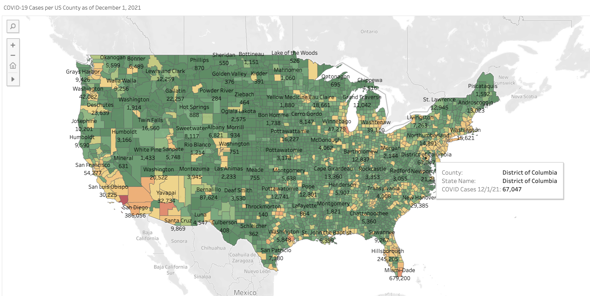
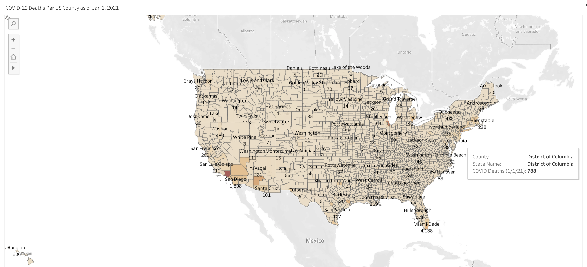

# Measuring the Impact of the COVID Epidemic

## Overview:

## Reason for Selecting Topic: 

The aim of our analysis is to determine how demographic factors including location, age-range, sex, race, and ethncity, contribute to the likelihood of developing severe responses to COVID-19? The team chose this topic since the COVID pandemic has dominated life in the United States over the past two years. As vaccines and medications have been developed, we wanted to explore and see which communities in the United States were most at risk for negative outcomes. 

## Source of Data: 

 We utilized sources provided by the CDC website which examined: 
  * Demographics of Patients withg COVID-19 in 2021 
  * Population Vaccination Data in 2021
  * Hospitalization and Mortality in Patients with COVID-19 in 2021

## Questions We Hope to Answer:

* How many deaths have been caused by COVID-19 in each state in the United States?
* How many cases have occurred in 2021?
* How many people have received the COVID-19 vaccine in each state?
* What demographic and economic factors might lead to vaccine hesitancy?
* Have COVID-19 vaccines led to a decrease in deaths in the United States?

## Team Members
Team Role | Name
--- | ---
Square | Emily Li
Triangle | Valentina Osorio
Circle | Zina Shah
X | Arielle Greenspan

## Data Overview

**Data Exploration Phase**:

* Clean data to determine number of cases and deaths
* Examine vaccination rates per state and county
* Determine factors which would reduce vaccination rate
* Depict data findings in Tableau and Javascript models.
* Depict data findings in Tableau and Javascript models.

**ERD:**
* Below is an ERD demonstrating the relationships between each of these entities from the different datasets we used for the machine learning model and visualizations:

**Original Datasets:**

 **Vaccinations**
 
 
 
**COVID Confirmed**

**COVID Deaths**

 
**Final Merged Dataset**

Most of our datasets came from various CDC sources. Due to the vast amount of data, we had to do some significant cleaning before we were able to use it for our machine learning model. There was a lot of data that we had to remove since it did not correlate to our project's main focus. There were missing and null values. We had to merge various CSV files by date, state and county. Overall, we managed to get a clean dataset to proceed with our analysis.
 
## Machine Learning Model

**Benefits of our Model**
* Collection of prediction trees helps estimate variable importance and can handle big data with multiple variables quickly.
* Our final question based on our available data was: Would these certain factors predispose patients to mortality from COVID-19? The random forest model was chosen since it would fit the parameters needed to predict a binary outcome.

**Steps Taken
* Removed features so the model was not so crowded. 
* Trained with a large dataset to help the algorithm. 
* Limited n estimators.

**Limitations of Our Model**
* May overfit if data is messy due to adding more decision trees to the algorithm for the best result.

**Our Model at Work**

## Challenges and Recommendations

* Many of our datasets were difficult to clean and did not merge properly with other datasets. Next time, we would use datasets that were more clean to start with. 
* When it came to creating our dashboard, some of our files were too large to work with when building the html page. In the future, we would decrease the size of the file and pare down the data prior to building the html page.
* We had such a large breadth of data from the CDC, so it was hard to tell what was really relevant to our predictive model. In the future, we would try to have a clearer vision of what data is necessary.

## Technology Used:
We used an array of software and analytic tools to complete our project. These resources are depicted and elaborated upon below:

* Python - Data Cleaning, Machine Learning Model
* Jupyter Notebook - Data Cleaning 
* Postgres (SQL) - Database
* Amazon Web Services (AWS) - Networked Database
* Google Colab - Machine Learning Model 
* Tableau - Data Visualizations 
* Flask - Webpage / Interactive Dashboard Creation 
* HTML - Webpage / Interactive Dashboard Creation
* Heroku - Deployment of Webpage 

## Visualizations:

Preview of some of our tableau visualizations:

* COVID cases per US county as of 1/1/2021

* COVID cases per US county as of 12/1/2021

* COVID deathes per US county as of 1/1/2021

* COVID deathes per US county as of 12/1/2021 

* US Hospitalizations over 2021

* COVID Hospitalizations and Deaths per Racial Group

The Tableau visuals that range from population, COVID-19 cases, deaths and vaccinations can be seen in the link below:

[View Our Tableau Data Dashboard](https://public.tableau.com/app/profile/zina.shah/viz/ADeepDiveintoCOVID-19LetsSeetheData/Final_Dashboard)

## Dashboard:

* Code utilized to build Dashboard can be found [here.](https://github.com/ariellegreenspan/covid-severity2)
* Conceptualization of Dashboard can be found [here.](https://docs.google.com/presentation/d/1ALpovgediQ_bLdq4W2oY2uJnHIKJHVdTsb4E91iFyhw/edit#slide=id.p)
* The link to our Heroku Dashboard can be found [here.](https://covid-severity2.herokuapp.com/)
* The link to our Vaccination Summary table can be found [here.](https://covid-severity2.herokuapp.com/summary)
* The link to our comprehensive data sourced from our database can be found [here.](https://covid-severity2.herokuapp.com/booster_table)

## Presentation:

* An Overview of our Presentation can be found [here.](https://docs.google.com/presentation/d/1PIXc8MoQCyhf88awjZfFVZ0AFq4j6_KTh0REr4ba3PE/edit?usp=drive_web&ouid=102424223461130273036)

