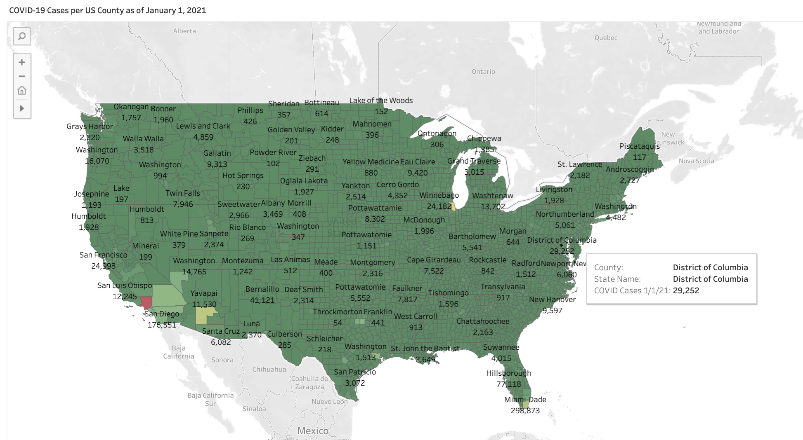
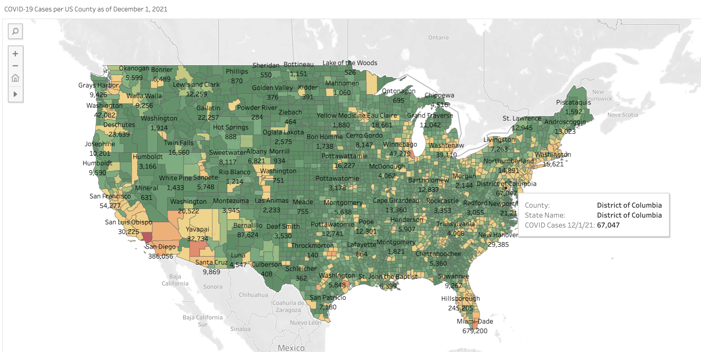
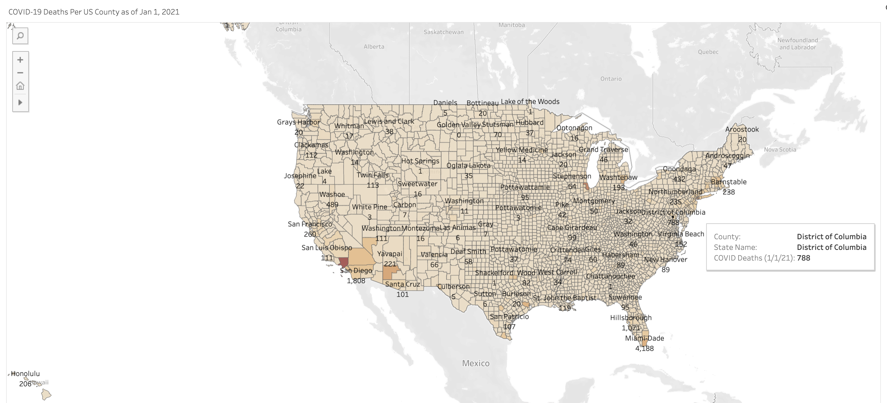
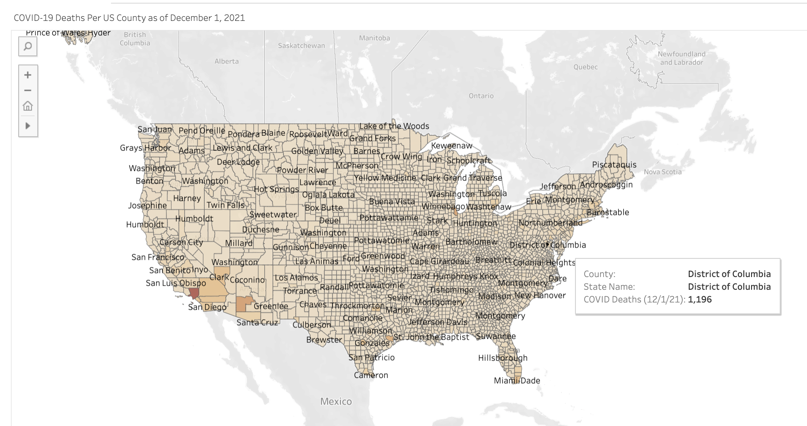
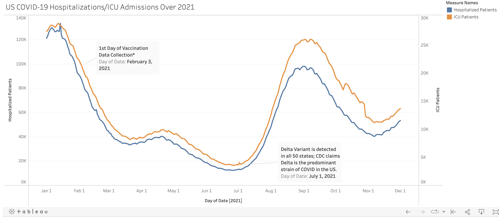
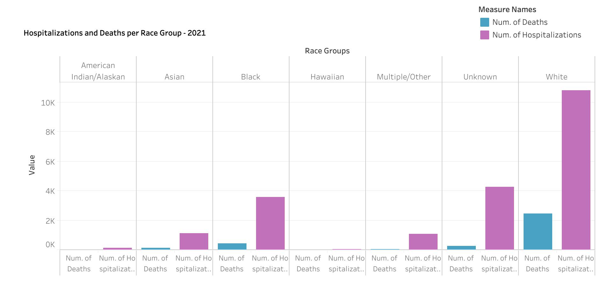

Final Dashboard and Visualizations:

## Visualizations:

A Preview of some of the Tableau visuals that range from COVID-19 cases, deaths and demographic data can be seen below:

* COVID cases per US county as of 1/1/2021

* COVID cases per US county as of 12/1/2021

* COVID deaths per US county as of 1/1/2021

* COVID deaths per US county as of 12/1/2021 

* US Hospitalizations over 2021

* COVID Hospitalizations and Deaths per Racial Group

  ### Our comprehensive Tableau Data Dashboard can be found below, explaining our data story.

   [View Our Tableau Data Dashboard](https://public.tableau.com/app/profile/zina.shah/viz/ADeepDiveintoCOVID-19LetsSeetheData/Final_Dashboard)

#### Tableau Dashboard:

Watch a video demonstration of our Tableau Visualization Dashboard:
* [Tableau Visualizations](https://vimeo.com/668098269)

## Interactive Machine Learning Dashboard:

* Code utilized to build Dashboard can be found [here.](https://github.com/ariellegreenspan/covid-severity2)
* Conceptualization of Dashboard can be found [here.](https://docs.google.com/presentation/d/1ALpovgediQ_bLdq4W2oY2uJnHIKJHVdTsb4E91iFyhw/edit#slide=id.p)
* The link to our Heroku Dashboard can be found [here.](https://covid-severity2.herokuapp.com/)
* The link to our Vaccination Summary table can be found [here.](https://covid-severity2.herokuapp.com/summary)
* The link to our comprehensive data sourced from our database can be found [here.](https://covid-severity2.herokuapp.com/booster_table)

#### Interactive Webpage Dashboard:

Watch a video demonstration of our Interative Web-based Dashboards:

* [COVID-19 Severity Predictor](https://vimeo.com/668080285)
* [Vaccination Status Tracker](https://vimeo.com/668080887)
* [Webpage Database Connection](https://vimeo.com/668081439)